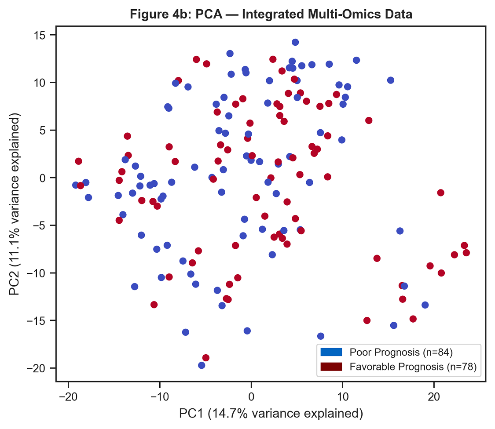
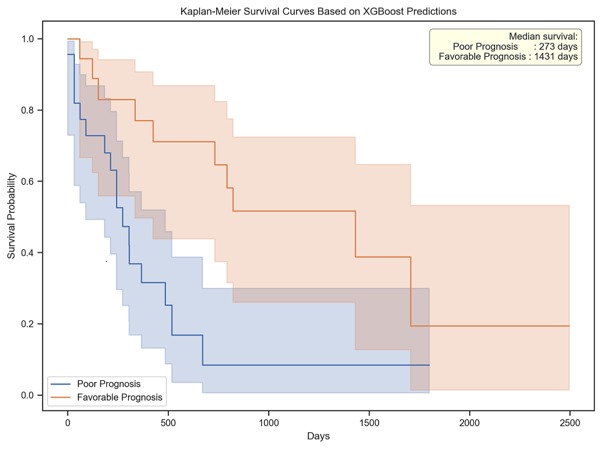

# AML Multi-Omics & Precision Medicine

### From Molecular Profiling to Survival-Related Prediction in TCGA-LAML

This project presents an end-to-end analysis of **Acute Myeloid Leukemia (AML)** using molecular and clinical data from **TCGA-LAML**.

The work combines exploratory molecular profiling, multi-omics integration, machine-learning model comparison, candidate biomarker discovery, and survival analysis to investigate whether molecular patterns can support clinically relevant patient stratification.

The project was developed across two related analytical phases:

1. **Exploratory multi-omics analysis** of mRNA expression, miRNA expression, and DNA methylation, including dimensionality reduction and multi-omics integration.
2. **Precision-medicine predictive modeling** using matched clinical, mRNA, and miRNA data, followed by model evaluation, candidate biomarker identification, and survival analysis.

> **Important:** MOFA-based multi-omics integration belongs to the exploratory phase of the project. The later machine-learning models were developed separately using matched mRNA and miRNA features and did not use MOFA factors as model inputs.

---

## Project Objectives

The project investigates several related questions:

- What major sources of molecular variation are present across AML patients?
- Can multiple molecular layers provide complementary information about AML heterogeneity?
- Can molecular profiles support prediction of patient outcome?
- Which molecular features contribute most strongly to predictive models?
- Do model-derived patient groups show differences in observed survival?

The goal is not to propose a clinically validated diagnostic or prognostic model, but to demonstrate an exploratory **precision-medicine analytics workflow** connecting molecular data with patient-level outcomes.

---

## Analytical Workflow

```text
TCGA-LAML Data
      │
      ├── Clinical Data
      ├── mRNA Expression
      ├── miRNA Expression
      └── DNA Methylation
              │
              ▼
     Individual Omics Profiling
              │
              ▼
       PCA / Molecular Patterns
              │
              ▼
 Exploratory Multi-Omics Integration
             (MOFA)
              │
              ▼
       Molecular Heterogeneity

────────────────────────────────────

Matched Clinical + mRNA + miRNA Data
              │
              ▼
        Data Preprocessing
              │
              ▼
        Feature Selection
              │
              ▼
       Predictive Modeling
     RF / SVM / XGBoost
              │
              ▼
       Model Evaluation
              │
              ▼
 Candidate Biomarker Analysis
              │
              ▼
   Kaplan-Meier Survival Analysis
              │
              ▼
 Precision-Medicine Interpretation
```

---

## Data

The analysis uses preprocessed molecular and clinical information from the **TCGA-LAML (Acute Myeloid Leukemia)** cohort.

### Exploratory Multi-Omics Phase

The earlier exploratory analysis examined:

- **mRNA expression**
- **miRNA expression**
- **DNA methylation**
- Clinical metadata

Individual molecular layers were investigated before exploratory integration using **MOFA (Multi-Omics Factor Analysis)**.

### Predictive Modeling Phase

For the later precision-medicine workflow, patient identifiers were harmonized across clinical, mRNA, and miRNA datasets.

The final matched modeling cohort contained:

- **162 patients**
- **500 selected mRNA features**
- **100 selected miRNA features**
- **600 molecular features in total**

Clinical outcome information was incorporated for supervised modeling and subsequent survival analysis.

---

## Exploratory Multi-Omics Analysis

The first phase focused on understanding molecular variation across AML patients.

Analyses included:

- Molecular feature distributions
- Patient-level molecular patterns
- Principal Component Analysis (PCA)
- Associations between molecular variation and clinical metadata
- Differential molecular feature exploration
- Multi-omics integration

MOFA was used as an **exploratory integration method** to investigate shared and modality-specific sources of variation across molecular layers.

This phase was designed to characterize AML molecular heterogeneity rather than build the later predictive classifier.

### Integrated Molecular Profile


The heatmap illustrates variation across selected molecular features for a subset of AML patients, providing a visual representation of patient-level molecular heterogeneity.

### Principal Component Analysis



PCA was used to examine dominant patterns of variation across the integrated molecular feature space.

---

## Precision-Medicine Modeling

The second analytical phase investigated whether matched molecular profiles could support patient outcome prediction.

Three supervised machine-learning algorithms were compared:

- **Random Forest**
- **Support Vector Machine (SVM)**
- **XGBoost**

The workflow included data preprocessing, feature selection, train/test evaluation, cross-validation, and comparison of predictive performance.

### Model Comparison


On the initial held-out split, **XGBoost achieved a ROC-AUC of 0.726**, outperforming the other evaluated models in that split.

The corresponding initial XGBoost performance included approximately:

- **Accuracy:** 70.7%
- **Sensitivity:** 65.0%
- **Specificity:** 76.2%
- **ROC-AUC:** 0.726

These results represent performance on the initial train/test split and should not be interpreted as externally validated clinical performance.

### Cross-Validation


Cross-validation produced more conservative estimates than the initial held-out evaluation.

This difference highlights an important modeling consideration: performance from a single split can overestimate generalization, particularly when working with relatively small biomedical cohorts and high-dimensional molecular data.

---

## Candidate Biomarker Analysis

Feature-importance analysis from the predictive workflow was used to identify molecular variables contributing strongly to model predictions.


The analysis generated a ranked set of **candidate mRNA and miRNA biomarkers** for further investigation.

These features should be interpreted as **model-derived candidate biomarkers**, not clinically validated biomarkers.

The corresponding results table is available here:

[`results/top20_candidate_biomarkers.csv`](results/top20_candidate_biomarkers.csv)

---

## Survival Analysis

To investigate whether model-derived patient stratification was associated with observed survival, predicted prognosis groups were evaluated using Kaplan-Meier analysis.



The predicted groups showed a statistically significant difference in observed survival distributions, with a reported:

**Log-rank p-value = 0.0044**

This suggests that the molecular prediction groups captured survival-related structure within the analyzed cohort.

However, this finding remains exploratory and requires validation in an independent patient cohort before clinical interpretation or application.

---

## Key Findings

The project demonstrates several important analytical findings:

- AML patients showed substantial molecular heterogeneity across the investigated molecular profiles.
- Multi-omics exploration provided a framework for examining shared patterns across molecular layers.
- XGBoost achieved a **ROC-AUC of 0.726** on the initial held-out split.
- Cross-validation produced more conservative performance estimates, emphasizing the importance of robust model evaluation.
- Feature-importance analysis identified a set of candidate mRNA and miRNA biomarkers.
- Model-derived patient groups demonstrated significantly different observed survival distributions (**log-rank p = 0.0044**).
- The analysis illustrates how molecular profiling, machine learning, and survival analysis can be connected within a precision-medicine workflow.

---

## Repository Structure

```text
aml-multiomics-precision-medicine/
│
├── README.md
│
├── notebooks/
│   └── AML_MultiOmics_Precision_Medicine_Analysis.ipynb
│
├── scripts/
│   ├── mrna_analysis.R
│   ├── mirna_analysis.R
│   ├── methylation_analysis.R
│   └── multiomics_integration.R
│
├── results/
│   ├── figures/
│   │   ├── integrated_multiomics_feature_heatmap.png
│   │   ├── pca_integrated_multiomics.png
│   │   ├── roc_curves_model_comparison.png
│   │   ├── model_evaluation_cross_validation.png
│   │   ├── top20_candidate_biomarkers.png
│   │   └── kaplan_meier_predicted_risk_groups.png
│   │
│   └── top20_candidate_biomarkers.csv
│
└── docs/
    ├── methodology.md
    └── results.md
```

---

## Tools & Technologies

**Programming & Analysis**

- Python
- R
- Pandas
- NumPy
- Scikit-learn
- XGBoost

**Statistical & Biomedical Analysis**

- Principal Component Analysis
- Multi-Omics Factor Analysis (MOFA)
- Feature importance analysis
- Kaplan-Meier survival analysis
- Log-rank testing

**Visualization**

- Matplotlib
- Seaborn
- R visualization packages

---

## Methodology & Results

Detailed documentation is available in:

- [Methodology](docs/methodology.md)
- [Detailed Results](docs/results.md)

The analysis notebook is available in:

- [AML Multi-Omics Precision Medicine Analysis](notebooks/AML_MultiOmics_Precision_Medicine_Analysis.ipynb)

---

## Limitations

This project should be interpreted as an exploratory biomedical data-analysis study.

Important limitations include:

- Relatively small matched patient cohort
- High dimensionality compared with sample size
- No independent external validation cohort
- Potential instability of feature importance across different training samples
- Simplification of survival information for the classification component
- Candidate biomarkers require independent biological and clinical validation

Accordingly, the predictive results should **not** be interpreted as a clinically validated AML prognostic model.

---

## Portfolio Context

This repository consolidates related academic analyses of the TCGA-LAML cohort into a reproducible portfolio project demonstrating skills in:

**Biomedical Data Analysis · Multi-Omics Analysis · Machine Learning · Statistical Analysis · Data Visualization · Biomarker Discovery · Survival Analysis · Precision Medicine**

Some analyses originated from collaborative academic coursework. This portfolio repository reorganizes and documents the analytical workflow for professional presentation while preserving the distinction between exploratory multi-omics integration and the later predictive modeling phase.

---

## Author

**Nada Emad**  
Data Analyst | Business, Operations & Healthcare Analytics  
B.Sc. Information Technology & Biomedical Informatics  
Nile University
